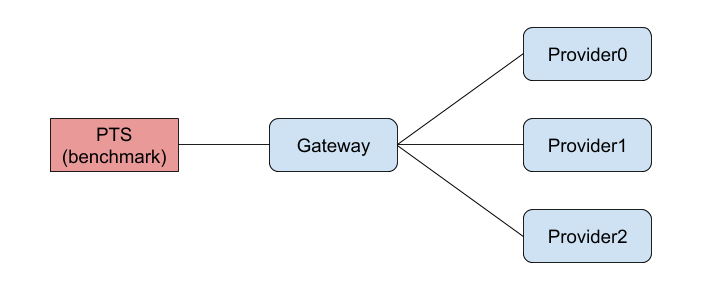

# 阿里巴巴2019中间件性能挑战赛-自适应负载均衡（初赛）赛题

[TOC]

## 背景

### 负载均衡 (loadbalance)
[负载均衡](https://en.wikipedia.org/wiki/Load_balancing_(computing))是大规模计算机系统中的一个基础问题。灵活的负载均衡算法可以将请求合理地分配到负载较少的服务器上。理想状态下，一个负载均衡算法应该能够最小化服务响应时间(RTT)，使系统吞吐量最高，保持高性能服务能力。自适应负载均衡是指无论当系统处在空闲、稳定还是繁忙状态，系统都应该保持较好的性能，不允许产生饥饿或者宕机。

### Apache Dubbo (incubating)
[Apache Dubbo (incubating)](http://dubbo.apache.org/zh-cn/) |ˈdʌbəʊ| 是一款高性能、轻量级的开源Java RPC框架，它提供了三大核心能力：面向接口的远程方法调用，智能容错和负载均衡，以及服务自动注册和发现。

### Apache Dubbo Gateway

### 题目由来

传统的负载均衡场景为单调度器模式，即中心化负载均衡：调度器负责将新到的请求立即转发至多个后端服务器中的一个。随着分布式系统的发展，这种单调度器模式在扩展性和可靠性方面的问题也愈发严重。因此，设计和实现去中心化且性能优异的负载均衡是学术和工业界的共同需求。

## 赛题说明

按照题目提供的扩展接口，实现一套自适应负载均衡机制。要求能够具备以下能力：

1. Gateway(Consumer) 端能够自动根据服务处理能力变化动态最优化分配请求保证较低响应时间，较高吞吐量。
2. Provider 端能自动进行服务容量评估，当请求数量超过服务能力时，允许拒绝部分请求，以保证服务不过载。
3. 当请求速率高于所有的 Provider 服务效率之和时，允许 Gateway( Consumer ) 拒绝服务新到请求。

### 架构
TBD

### 服务

TBD

### 调用流程

TBD

### 开发接口

TBD

### 辅助接口

TBD

### 限制

### 环境

### 目标

1. 保证系统稳定性，任何情况下服务都不能被打挂；
2. 保证请求成功率，尽可能的让更多的请求在较短的时间内被处理；
3. 尽可能避免因重试导致流量被过度放大。

## 评测

### 环境

- Gateway ： 1 台 
- Provider ： 3台
  - Provider-small: 1c2g
  - Provider-medium: 2c4g
  - Provider-large: 4c8g
- 每个 Provider 的服务能力(处理请求的速率)都会不定期变化：
  - 三台机器的总处理能力会分别在小于/约等于/大于请求量三个状态变动；
  - 三台机器任意一台的单台处理能力都小于总请求量。

### 评测流程

流程分为预热和正式评测两部分，预热部分不计算成绩，正式评测部分计算成绩。

#### 预热

1. 启动 Gateway 和 Provider；
2. PTS 按固定请求速率向 Gateway 发请求，持续 30 秒。
3. 预热结束，10秒后进行。

#### 正式评测

1. PTS 以固定请求速率向 Gateway 发送请求；
2. Provider 的服务能力会按照一定规则变动；
3. 3分钟后，PTS 停止发请求，压测结束。

### 排名规则

1. 按照 PTS 统计的成功请求数和最大 TPS 作为排名依据；
2. 成功请求数越大，排名越靠前；
3. 成功数相同的情况下，按照最大 TPS 排名。

样例：

| 排名 | 成功请求数 | 最大 TPS |
| :--: | :--------: | :------: |
|  1   | 1,000,000  |  9,999   |
|  2   | 1,000,000  |  9,998   |
|  3   |  800,000   |  10,000  |